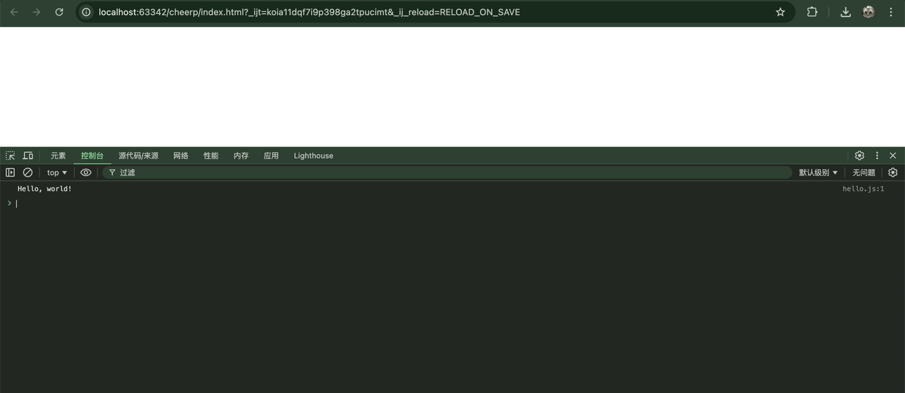

# cheerp 简单的使用说明笔记


## install
- mac / win / linux
- https://github.com/leaningtech/cheerp-meta/releases

## run

### mac
```shell
/Applications/cheerp/bin/clang++ hello.cpp -o hello.js
```

### win
```shell
C:\cheerp\bin\clang++.exe hello.cpp -o hello.js
```

## es6
```shell
/Applications/cheerp/bin/clang++ hello.cpp -o hello.js -cheerp-make-module=es6
```

## 解读
- 在编译后的js中 new URL('hello.wasm', import.meta.url),似乎cheerp是使用js和wasm建立桥接
- 我直接调用wasm无法在export中拿到导出的函数,所以并不是像emsdk那样使用


## screenshot

